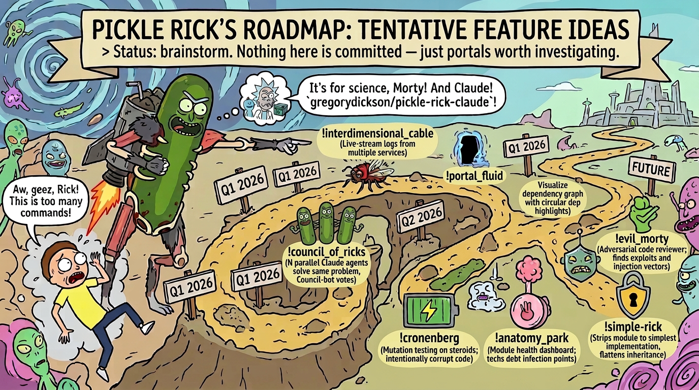

# Pickle Rick Roadmap

> Tentative feature ideas. Status: brainstorm. Nothing here is committed — just portals worth investigating.

## Proposed Features

### /interdimensional-cable
Live-stream logs from multiple running services side-by-side in a TUI. Each pane is a "channel" you can flip through.

### /portal-fluid
Dependency graph visualizer. Shows how packages flow between repos like portal fluid through the gun. Highlights circular deps in toxic green.

### /vindicators
Spin up N parallel Claude agents that each solve the same problem differently, then a judge agent votes on the best solution. Each Vindicator takes a different approach — the mission succeeds when the strongest solution is chosen.

### /szechuan-sauce
A "time machine" for config files. Tracks every change to `.env`, `tsconfig`, `package.json` etc. across branches and lets you restore any historical combo.

### /butter-robot
Single-purpose bot generator. Give it one task ("run lint on save" / "ping me when tests fail") and it creates a minimal daemon that does exactly that.

### /cronenberg
Mutation testing on steroids. Intentionally corrupts the codebase in horrifying ways and checks if the test suite catches it. If tests still pass, you've Cronenberg'd yourself.

### /tiny-rick
Minification and bundle analysis. Shrinks code down to its smallest, most energetic form.

### /plumbus
Auto-generates boilerplate that everyone needs but nobody wants to explain. Scaffolds services, endpoints, test files.

### /squanch
Universal search-and-replace across the entire monorepo with preview, rollback, and regex support.

### /death-crystal
Predictive impact analysis. Shows all possible futures (code paths) affected by a current change. Builds on GitNexus impact analysis with forward-looking path exploration.

### /get-schwifty
Performance benchmarking suite. Runs load tests, profiles memory, and judges code performance.

### /microverse-battery
Nested Docker environment generator. Containers within containers, each powering the one above it. Microservices with extra steps.

### /simple-rick
Strips a complex module down to its simplest possible implementation. Removes every abstraction, flattens every inheritance chain.

### /gazorpazorp
Dependency spawner. One command creates a child package with all the right tsconfig inheritance, shared types, and build pipeline.

### /fleeb-juice
Secret rotation and environment variable manager. Detects hardcoded secrets, extracts them, and rotates them on a schedule.

### /mr-poopybutthole
Companion agent that watches your coding session and periodically summarizes what you've done. Always honest, even when it hurts.

### /unity
Monorepo sync tool. When you change a shared type or interface, Unity assimilates every consuming package to stay compatible. One mind, one type system.

### /evil-morty
Adversarial code reviewer. Deliberately tries to find exploits, injection vectors, and security holes in PRs. Thinks three steps ahead.

### /blips-and-chitz
Gamified test coverage. Assigns points for covering edge cases, achievement badges for hitting coverage thresholds. Roy: A Life Well Tested.

### /anatomy-park
Code health dashboard. Zooms into a module like a human body — shows infection points (tech debt), organ failure (deprecated deps), and vital signs (test health, build time).

### /meseeks-box
Spawns disposable agents for one-shot tasks: "generate fixtures," "write migration," "stub this API." They exist to serve a single purpose, then poof.

### /galactic-federation
Centralized audit log across all repos. Every deploy, PR merge, config change — tracked with federation-level bureaucracy.

### /story-train
Auto-generates changelogs and release notes from commit history by weaving commits into a coherent narrative. Each release is an "episode."

### /detoxifier
Tech debt remediation. Scans for code smells, complexity hotspots, and outdated patterns, then generates targeted refactoring tickets.

### /jerry-detector
Identifies code that's trying too hard and accomplishing too little. Over-abstracted factories, unnecessary wrapper classes, enterprise-grade hello worlds.

### /birdperson
Long-running integration test orchestrator. Patient, methodical, reliable. Runs the slow E2E suites that nobody wants to wait for.

### /phoenix-person
Auto-resurrection for failed deployments. Detects a bad deploy, rolls back, and redeploys the last known good version.

### /ricks-garage
Local dev environment bootstrapper. One command sets up the entire local stack — databases, services, env files, seed data.

### /time-crystal
Build caching and incremental compilation optimizer. Analyzes what actually changed and skips everything that doesn't need rebuilding.

### /citadel
Multi-environment management. Spin up, tear down, and switch between dev/staging/prod configs like walking between dimensions.

### /scary-terry
Nightmare scenario generator for APIs. Fuzzes endpoints with malformed payloads, missing auth, absurd edge cases.

### /two-brothers
Pair programming mode. Two Claude agents work the same file — one writes code, one writes tests. It's just two brothers. In a codebase.

### /memory-parasites
Detects and removes dead imports, unused variables, orphaned files, and zombie exports that are imported nowhere. Like Total Rickall — everything that can't prove it belongs gets eliminated.

### /ricks-flask
Schema evolution manager. Generates migration scripts when types, DB schemas, or API contracts change. Diff the old and new, brew the migration, apply it safely.

### /interdimensional-customs
Pre-merge validation that checks a PR against every downstream consumer repo. "Papers, please" — your change doesn't cross the border until all dependents pass.

### /morty-mindblowers
Extracts lessons from failed CI runs, reverted PRs, and rolled-back deploys into a searchable knowledge base. Every failure is a mind-blower worth remembering.

### /snake-jazz
Rhythm-based rate limiting and retry logic generator. Give it an API integration and it generates backoff strategies, circuit breakers, and retry patterns that groove.

### /doofus-rick
Intentionally dumbed-down code explainer. Takes complex code and rewrites it at a junior-dev reading level with heavy comments. Not the smartest Rick, but the most helpful.

### /froopyland
Sandbox environment for running untrusted or experimental code. Spins up an isolated container, runs the code, captures output, tears it down. Nothing escapes Froopyland.

### /operation-phoenix
Clone detector across repos. Finds copy-pasted code between projects that should be a shared library. If you die in one repo, you wake up in another with the same code.

### /glorzo
"Glory to Glorzo" — monotask enforcer. Locks the session to ONE ticket/issue until it's done. No context switching, no tangents. Hive mind focus.

### /nimbus
Cloud cost analyzer. Scans IaC (CDK, Terraform, CloudFormation) and estimates monthly cost impact of infrastructure changes before they deploy.

### /rickmobile
Mobile-first responsive audit. Runs a page through viewport sizes, checks touch targets, font scaling, and layout breakpoints. The Rickmobile visits every screen size.

### /wendys
"We're not going back to Bendigo!" — Rollback guard. Before any destructive migration, data deletion, or schema drop, it snapshots the current state and generates a verified rollback script. You can always go back.

### /morty-smith-database
Type-safe mock data generator. Reads your schemas (Drizzle, Prisma, Zod, JSON Schema) and generates realistic, referentially-intact seed data. Every Morty is unique but structurally valid.

### /ghost-in-a-jar
Wraps any long-running process in a persistent container that survives terminal disconnects. Ghost in a jar can't die — reconnect anytime and pick up where you left off.

### /pickle-pipeline
DAG-based task orchestrator for multi-step data pipelines. Define steps as nodes, dependencies as edges. Retry failed nodes without re-running the whole pipeline. It's a pickle pipeline, Morty.

### /wubba-lubba-dub-dub
Burndown and velocity tracker. Reads ticket history, commit velocity, and PR merge rate to generate a "pain index." High score means the team is crying for help.

### /ants-in-my-eyes-johnson
Accessibility auditor. Scans UI code for ARIA violations, contrast failures, keyboard navigation gaps, and screen reader incompatibilities. Can't see the problems? That's the point — this tool can.
